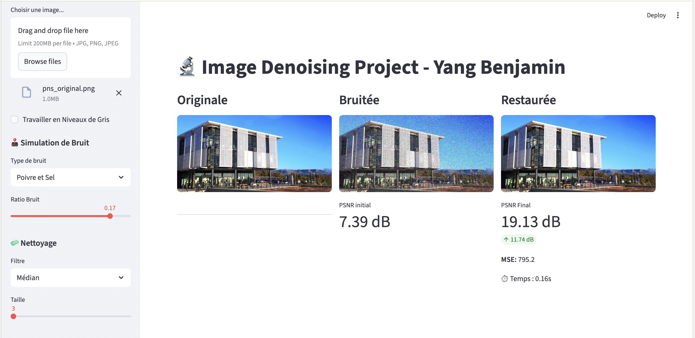

# The Denoising Project
### Benjamin Yang

This project is the logical next step following my work on Harris Corner Detection. After learning how to extract features, I am now focusing on **image restoration**. It is a deep dive into the mathematical and computational challenges of removing noise while preserving the integrity of a signal.

## Why this project?

In medical imaging (MedTech), noise is inevitable. Whether in radiography or MRI, the physics of the sensor always "pollutes" the original signal. My goal with this project was to move beyond using black-box libraries and understand how to:
1. **Model noise**: Mathematically define and simulate different types of disturbances, such as Gaussian noise (sensor grain) and Salt & Pepper noise (impulsive interference).
2. **Filter intelligently**: Discover and implement algorithms capable of cleaning an image while preserving critical details like edges and textures, which are vital for medical diagnosis.

## Approach & Implementation

As with my previous projects, I followed a step-by-step approach, starting from the simplest linear methods and moving toward state-of-the-art non-local algorithms.

### Linear and Non-Linear Foundations
I started by implementing Gaussian and Median filters. While the Gaussian filter is excellent for general smoothing, it tends to blur sharp edges. The Median filter, however, proved to be the only reliable way to handle Salt & Pepper noise by looking at the statistical distribution of the neighborhood rather than a weighted average.

### Edge-Preserving Restoration (Bilateral Filter)
The Bilateral filter was a significant step forward. It introduces an intensity weight that prevents the filter from smoothing across high-contrast edges. 
The weight $W$ for a pixel $c$ and its neighbor $v$ is:
$$W(c, v) = \exp\left( -\frac{\|p_c - p_v\|^2}{2\sigma_s^2} \right) \cdot \exp\left( -\frac{|I_c - I_v|^2}{2\sigma_r^2} \right)$$
Implementing this taught me how to handle range and spatial kernels simultaneously in a vectorized way.

### The Challenge of Non-Local Means (NLM)
The final stage was the Non-Local Means algorithm. Unlike local filters, NLM assumes that natural images have redundant patterns. It compares small patches across a search window to find similarities. 
The similarity between two patches $P_i$ and $P_j$ is computed as:
$$w(i, j) = \frac{1}{Z(i)} \exp\left( -\frac{\| P_i - P_j \|^2_2}{h^2} \right)$$

The main challenge here was computational efficiency. To avoid nested loops that would take minutes to run, I used a specific trick: applying a Gaussian convolution on the squared differences of shifted image arrays. This allowed me to compute patch distances for the entire image at once.

## Key Takeaways

### The PSNR Paradox
Throughout the project, I used MSE and PSNR to evaluate quality. I learned that a better mathematical score doesn't always translate to a better-looking image. NLM often yields a lower MSE than a heavily smoothed Bilateral filter, but it preserves reality and structural textures far better, which is crucial for human interpretation.

### Vectorization and Performance
Implementing these filters from scratch forced me to master NumPy vectorization. Moving from pixel-wise loops to shifted array operations reduced execution time from several minutes to a few seconds. This transition is essential for making these algorithms viable in any real-world production environment.

---
*Yang Benjamin, Feb 2026*